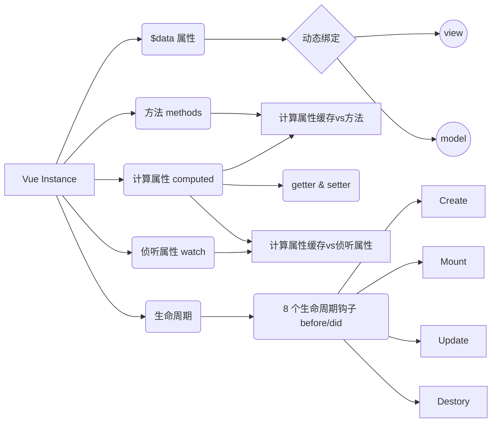
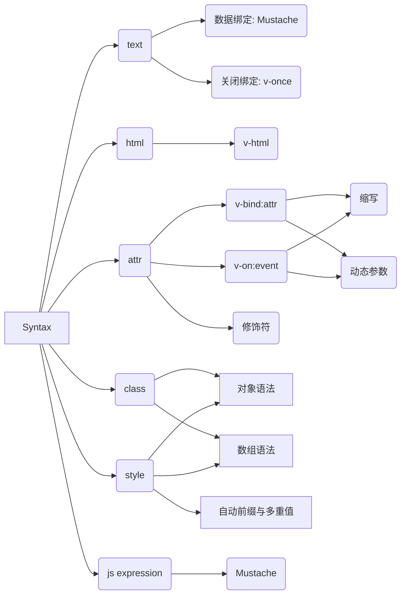

这款由中国人开发的框架早有耳闻，听说学习曲线非常平滑，容易学习也容易印象不深，因此使用思维导图的方式把知识点记录下来。

**目录**

* TOC
{:toc}

## Vue Instance

```mermaid
graph LR
A[Vue Instance] --> B($data 属性)
A --> C(生命周期)
B --> B1{动态绑定}
B1 --> B11((view))
B1 --> B12((model))
A --> E(方法 methods)
A --> D(计算属性 computed)
A --> F(侦听属性 watch)
E --> 计算属性缓存vs方法
D --> 计算属性缓存vs方法
D --> D1(getter & setter)
D --> 计算属性缓存vs侦听属性
F --> 计算属性缓存vs侦听属性
C --> C1(8 个生命周期钩子 before/did)
C1 --> Create
C1 --> Mount
C1 --> Update
C1 --> Destory
```

## Template syntax

```mermaid
graph LR
A[Syntax] --> B(text)
B --> B1(数据绑定: Mustache)
B --> B2(关闭绑定: v-once)
A --> C(html) --> C1(v-html)
A --> D(attr)
D --> D1(v-bind:attr)
D --> D2(v-on:event)
D1 --> D4(缩写)
D2 --> D4
D1 --> D3(动态参数)
D2 --> D3
D --> D5(修饰符)
A --> F(class)
F --> 对象语法
F --> 数组语法
A --> G(style)
G --> 对象语法
G --> 数组语法
G --> 自动前缀与多重值
A --> E(js expression) --> E1(Mustache)
```

